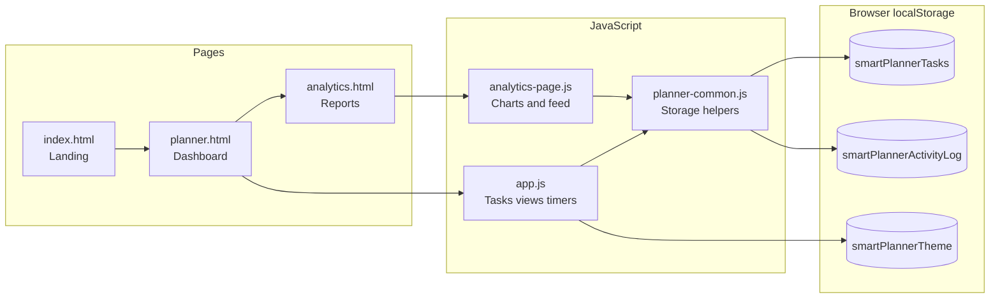

# Smart Planner — Presentation Guide

Use this during your demo or slides. **Suggested length: 5–8 minutes.**

**Find sections:** search `SECTION:` in this file, or use the headings below.

---

<!-- SECTION: Opening -->
## 30-second opening (say this first)

> **Smart Planner** is a browser-based daily task dashboard. You plan by date, switch views like Today and Meetings, track time on tasks, and set one focus priority—all without creating an account. Everything is stored on your device in the browser, so it is fast, private, and works offline after the first load.

---

<!-- SECTION: Q&A one-liners -->
## One-line answers (if someone asks quickly)

| Question | Answer |
|----------|--------|
| What is it? | A local-first task planner for organizing your day. |
| Who is it for? | Anyone who wants a simple daily dashboard without sign-up. |
| How is data saved? | In `localStorage` on the user’s browser—no server database. |
| Why not use a big app? | Lightweight, private, no account, instant open. |
| What makes it “smart”? | Views, focus task, progress stats, timers, and analytics from your own activity. |

---

<!-- SECTION: Problem & solution -->
## Problem → Solution (30 seconds)

**Problem**

- Many planners need accounts, sync, and feel heavy for “just today’s list.”
- People want date + category + time in one place, not a flat endless list.

**Solution**

- Three pages: **Landing** (explain the product) → **Planner** (work) → **Analytics** (review).
- Date-first tasks, sidebar views, one focus task, optional time tracking, activity history.

---

<!-- SECTION: Architecture diagram -->
## Architecture (show this diagram)

**Say in one sentence:**  
“The UI is static HTML; JavaScript reads and writes JSON in `localStorage`; there is no backend API.”

---

<!-- SECTION: Slide outline -->
## Suggested slide order (7 slides)

| # | Slide title | What to say (bullet) |
|---|-------------|----------------------|
| 1 | **Smart Planner** | Daily task dashboard · local-first · no sign-up |
| 2 | **The problem** | Cluttered lists · accounts · no simple “today” view |
| 3 | **What we built** | Landing + Planner + Analytics · 3 HTML pages · vanilla JS |
| 4 | **Live demo** | *(run demo script below)* |
| 5 | **Key features** | Dates · views · focus · timers · filters · dark mode |
| 6 | **Data & privacy** | Tasks and activity log stay in the browser |
| 7 | **Wrap-up** | Fast, private, complete flow from plan → track → review |

---

<!-- SECTION: Live demo script -->
## Live demo script (3–4 minutes)

Do this in order so the story is clear.

### 1. Landing page (`index.html`) — ~45 sec

1. Open `index.html`.
2. Point to **hero**: “Plan your day in one dashboard.”
3. Scroll to **Features**: date planning, views, focus, progress, filters, private storage.
4. Scroll to **How it works**: Open planner → Add with context → Complete, filter, focus.
5. Click **Open Planner**.

**Line to say:**  
“This page sells the product; the real app is one click away.”

---

### 2. Planner — add and organize — ~90 sec

1. Show **sidebar**: Today, Inbox, Upcoming, Meetings, Design, Analytics.
2. Show **stats**: Total, Completed, Progress %.
3. **Add a task** (inline form):
   - Title: e.g. “Client call”
   - Time: e.g. 10:00
   - Category: Meetings
4. Show the task row: checkbox, category badge, date/time.
5. Click **Focus** on that task → point to **Focus task** strip at bottom.
6. Toggle filter: **Pending** → **Done** → **All**.
7. **Check the task** complete → watch progress % update.

**Line to say:**  
“Everything you see updates immediately because we only read and write local data—no waiting on a server.”

---

### 3. Planner — views and date — ~45 sec

1. Click **Meetings** in sidebar → only Meeting-category tasks (URL: `?view=meetings`).
2. Click **Upcoming** → tasks on future dates.
3. Click **Today** → use **date picker** in header to pick another day.
4. Open **Add Task** modal → show date, time, category, **Show in** (placement).

**Line to say:**  
“Views and the URL stay in sync—you can refresh the page and keep the same view.”

---

### 4. Timer — ~30 sec

1. On an **open** task, click **Start** on the stopwatch.
2. Wait a few seconds; show the counter ticking.
3. Click **Pause** → time is saved on the task.

**Line to say:**  
“Only one timer runs at a time; when you leave the tab, we save the segment so time is not lost.”

---

### 5. Theme + Clear day — ~20 sec

1. Click **moon/sun** icon → dark mode.
2. (Optional) On **Today**, mention **Clear Day** removes all tasks for that date after confirm.

---

### 6. Analytics — ~60 sec

1. Open **Analytics** from sidebar.
2. Point to **summary chips**: total, completed, open, time tracked, days with tasks.
3. Point to **last 14 days** bar chart and **by category** bars.
4. Scroll **All tasks** table.
5. Scroll **Activity log**: created, completed, time logged, focus, etc.
6. Click **Refresh** if you added tasks in another tab.

**Line to say:**  
“We don’t only store tasks—we log actions so the user can see a history of what they did on this device.”

---

<!-- SECTION: Feature cheat sheet -->
## Feature cheat sheet (for slides or handout)

| Feature | What it does | Why it matters |
|---------|----------------|----------------|
| **Date-first** | Tasks grouped by `YYYY-MM-DD` | Matches how people think about “my day” |
| **Views** | Today, Inbox, Upcoming, Meetings, Design | Less scrolling; right context |
| **Categories** | Meetings, Design, Planning, Personal | Scannable labels on each task |
| **Focus task** | One highlighted priority per day | Clear “do this first” |
| **Filters** | All / Pending / Done | Quick status check |
| **Stats** | Total, done, % progress | Motivation without heavy analytics |
| **Timer** | Start/pause per task | Built-in time tracking |
| **Modal add** | Richer create with placement | Add to inbox or upcoming in one step |
| **Dark mode** | Theme in localStorage | Comfort for long use |
| **Analytics** | Charts + table + activity log | Review habits on same device |
| **URL state** | `?view=` and `?date=` | Shareable/bookmarkable planner state |

---

<!-- SECTION: Tech stack talking points -->
## Tech stack (30 seconds — for technical audience)

- **Frontend only:** HTML, CSS, Bootstrap 5, Font Awesome
- **Logic:** Vanilla JavaScript (`app.js`, `analytics-page.js`, `planner-common.js`)
- **Storage:** `localStorage` (tasks JSON + activity log, max 400 events)
- **Extras:** jQuery + Bootstrap Datepicker for calendar in header
- **No:** Node backend, database, authentication, or build pipeline required

**Strength:** Simple to host (any static server or even file open).  
**Trade-off:** Data is per-browser, per-device—not synced across phones unless you add that later.

---

<!-- SECTION: Activity log -->
## Activity log (explain in one breath)

> When you create, complete, delete, log time, set focus, or clear a day, we append an event. Analytics turns that into a timeline so users see *what happened*, not just *what’s on the list today*.

Event types: `task_created`, `task_completed`, `task_reopened`, `task_deleted`, `time_logged`, `focus_set`, `day_cleared`.

---

<!-- SECTION: Q&A prep -->
## Possible questions & answers

**Q: Where is the data stored?**  
A: In the browser’s `localStorage` under keys like `smartPlannerTasks` and `smartPlannerActivityLog`.

**Q: What if the user clears browser data?**  
A: Tasks and history are removed—that’s the trade-off for zero backend.

**Q: Can two users share one list?**  
A: Not in this version; it’s single-user, single-device.

**Q: Does it work offline?**  
A: After the first load, the app logic works offline; CDN libraries need network on first visit unless bundled locally.

**Q: How would you extend it?**  
A: Cloud sync (Firebase/Convex), export CSV, reminders/notifications, mobile PWA, team workspaces.

**Q: Why vanilla JS instead of React?**  
A: Small scope, no build step, easy to open and demo in any classroom or lab machine.

---

<!-- SECTION: Closing -->
## Closing statement (15 seconds)

> Smart Planner shows a full product flow—landing, daily planning, time tracking, and analytics—using only the browser. It’s private by default, fast to run, and demonstrates real features users expect from a modern task app, without the complexity of accounts or a server.

---

<!-- SECTION: Pre-demo checklist -->
## Quick checklist before you present

- [ ] Run from `http://localhost` (not `file://`) so date picker and URLs work reliably
- [ ] Add 2–3 sample tasks on different dates/categories before you start
- [ ] Run a timer for ~10 seconds so Analytics shows “time tracked”
- [ ] Set one focus task so the bottom strip is not empty
- [ ] Toggle dark mode once so reviewers see polish
- [ ] Open Analytics last as the “wow” summary page

---

<!-- SECTION: Files reference -->
## Files to mention if asked “what did you build?”

| File | Role |
|------|------|
| `index.html` | Marketing landing |
| `planner.html` | Main app UI |
| `analytics.html` | Reports & activity |
| `js/app.js` | Core planner logic |
| `js/planner-common.js` | Shared storage & dates |
| `js/analytics-page.js` | Charts & feed |
| `css/style.css` | All styling + dark mode |
| `README.md` | Full project documentation |

---

*Good luck with your presentation.*
